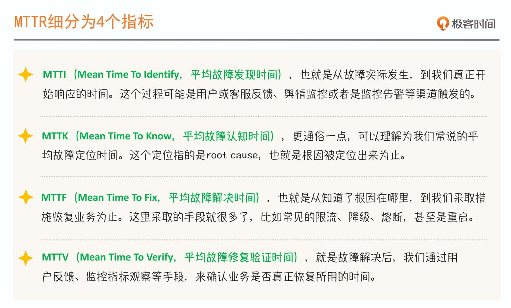

# 如何理解 SRE

## SRE 到底是什么

SRE 是一套体系化的方法，只有用全局视角才能更透彻地理解它。

这包括但不限于容量评估、故障演练、服务降级、服务限流、异常熔断、监控告警等。

从实践角度来看，SRE 是一个体系化工程，它需要协同多个部门、多项技术。如：

- 运维自动化：
    - 容量扩缩容
    - 监控告警

- DevOps：
    - 持续交付
    - 配置变更
    - 灰度发布

## 如何做好 SRE ？

首先要知道 SRE 的根本目的是**提升稳定性**。而稳定性的衡量标准有两个关键指标：

- MTBF，Mean Time Between Failure，平均故障时间间隔。
- MTTR，Mean Time To Repair， 故障平均修复时间。

因此，**做好 SRE**，也就是**提升稳定性**，有两个方向：

- 提升 MTBF，也就是减少故障发生次数，提升故障发生间隔时长；
- 降低 MTTR，故障不可避免，那就提升故障处理效率，减少故障影响时长。

## 故障修复过程中的细分指标

MTTR 可以细分为 4 个指标：MTTI、MTTK、MTTF 和 MTTV。

## 三个阶段

在 Pre-MTBF 阶段（无故障阶段），我们要做好架构设计，提供限流、降级、熔断这些 Design-for-Failure 的服务治理手段，以具备故障快速隔离的条件；

在 Post-MTBF 阶段，也就是上一故障刚结束，开启新的 MTBF 阶段，我们应该要做故障复盘，总结经验，找到不足，落地改进措施等；

在 MTTI 阶段，我们就需要依赖监控系统帮我们及时发现问题

## 总结

1. SRE 是团队协同作战。
2. SRE 本质上是减少故障时间，增加系统正常运行时间，也就是「减少故障，延长 MTBF」；同时，「提升故障处理效率，缩短 MTTR」。
