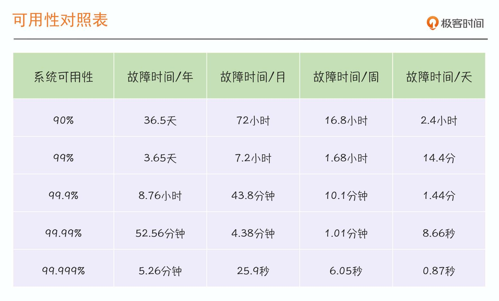

# 当我们在谈系统可用性时，我们想要说什么

系统可用性（Availability）的概念，也就是我们常常听到的「3个9」（99.9% 或 99.95%）、「4个9」（99.99% 或 99.995%）。

## 衡量系统可用性的两种方式

- 时间维度：$Availability = Uptime / (Uptime + Downtime)$
- 请求维度：$Availability = Successful request / Total request$

我们发现用时长维度来衡量系统稳定性的方式，其主要缺点就是粒度不够精细，因此在 SRE 实践中，请求维度，是从成功请求占比的角度出发，对系统的稳定性进行评估。

## 总结

**故障一定意味着不稳定，但是不稳定，并不意味着一定有故障发生**。

SRE 会更多采用请求维度的统计方式，因为 SRE 关注的稳定性是系统的整体运行状态，而不仅仅只关注故障状态下的稳定性，在系统运行过程中的任何异常，都会被纳入稳定性的评估范畴中。
