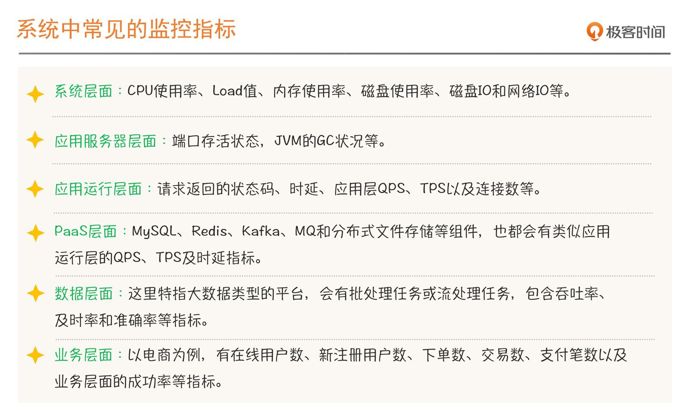

# 做好 SRE 工作的切入点

SRE 强调的稳定性，一般不是看单次请求的成功与否，而是看整体情况。

## 两个概念

- SLI，Service Level Indicator，服务等级指标，其实就是我们选择哪些指标来衡量我们的稳定性
- SLO，Service Level Objective，服务等级目标，指的就是我们设定的稳定性目标，比如「几个9」这样的目标

SLI 是监控的指标，SLO 是这个指标对应的目标。

## 如何选择 SLI ？

- 一：选择能够标识一个主体是否稳定的指标，如果不是这个主体本身的指标，或者不能标识主体稳定性的，就要排除在外

- 二：针对电商这类有用户界面的业务系统，优先选择与用户体验强相关或用户可以明显感知的指标

快速识别 SLI 指标的方法：VALET

- Volume（容量）：指服务承诺的最大容量。比如，一个应用集群的 QPS、TPS、会话数以及连接数等等

- Availablity（可用性）：服务是否正常。比如请求调用的非 5xx 状态码成功率

- Latency（时延）是说响应是否足够快

- Errors-错误率

- Tickets-人工介入

## 如何制定 SLO ？

Availability = SLO1 & SLO2 & SLO3

只有当这个三个 SLO 同时达标时，整个系统的稳定性才算达标，有一个不达标就不算达标

## 总结

做好 SRE 工作的切入点是 SLI 和 SLO：

1. 对系统相关指标要分层，识别出我们要保障稳定性的主体（系统、业务或应用）是什么，然后基于这个主体来选择合适的 SLI 指标。

1. 不是所有的指标都是适合做 SLI 指标，它一定要能够直接体现和反映主体的稳定性状态。可以优先选择用户或使用者能感受到的体验类指标，比如时延、可用性、错误率等。

1. 掌握 VALET 方法，快速选择 SLI 指标。
