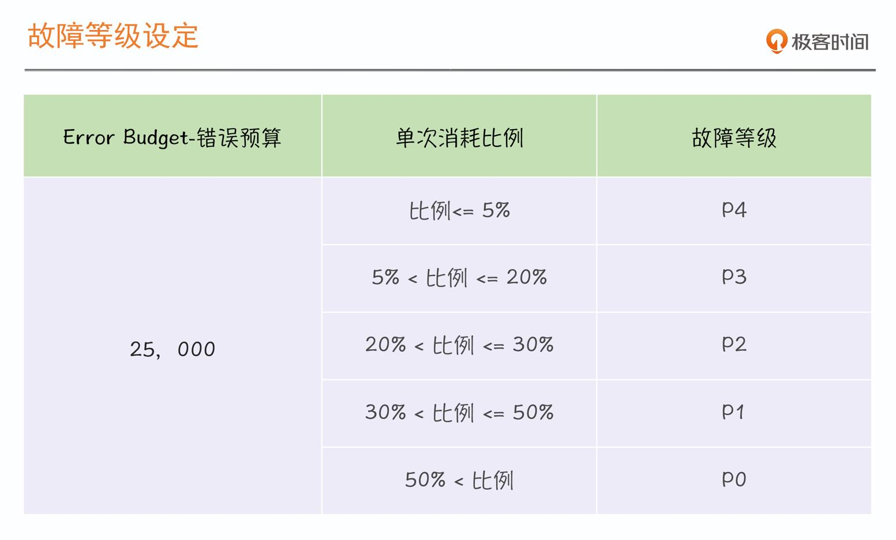

# 错误预算

知道了 SLI 和 SLO，如何达成稳定性目标？

答案是：落地 SLO，先转化为 Error Budget。类比，驾照记分制。

错误预算即容许的错误次数，是通过 SLO 反向推导出来的。下面我举个例子，你马上就可以理解了。

在 SLO 落地实践时，我们通常就把 SLO 转化为错误预算，以此来推进稳定性目标达成。

## 错误预算有哪些作用？

1. 画稳定性燃尽图，协助判断工作目标的达成情况
1. 用于故障定级

    

1. 建立稳定性共识机制

    - 剩余预算充足或未消耗完之前，对问题的发生要有容忍度

    - 剩余预算消耗过快或即将消耗完之前，SRE 有权中止和拒绝任何线上变更

1. 基于错误预算的告警

    - 合并相同相似告警

    - 数量少且精准

## 如何衡量 SLO 的有效性？

三个关键维度：

- SLO 达成情况：达成（Met）/未达成（Missed）

- 人工投入（Toil）程度：投入程度高（High）/ 低（Low）

- 用户满意度（Customer Satisfaction）：满意度高（High）/ 低（Low）

## 如何调整 SLO ？

第一类，收紧 SLO。

这个时候就是目标定得太低了，比如 SLO 达成（Met），但是用户不满意（Low）。会有什么后果呢？要么投诉多，要么到处吐槽。这就表示我们的 SLO 设定得太容易达成，没有反馈真实的运行状况。

第二类，放宽 SLO。

与第一类相反，目标定太高，总是达不成（Missed），但用户反馈却很不错（High），这种就会造成错误预算提前消耗完，导致很多变更暂停，产品延期，甚至会做一些无谓的优化，这时就可以适当松松绑。

第三类，保持现状，对有问题的维度采取有针对性的优化措施。

## 总结

错误预算是通过 SLO 推导出来的，为了达成 SLO，就要尽量减少对它的消耗。

错误预算的警示效果更显著，所以我们通常会围绕它来开展稳定性保障工作。落地错误预算可以遵循一些基本原则，比如要对系统故障或问题有容忍度，在预算消耗过快或消耗殆尽之前，SRE 有权减少或拒绝线上变更等等，这些策略要自上而下达成共识。

SLO 和错误预算是否合理，基于它们的策略是否有效，我们可以通过 SLO 达成情况、人肉投入程度和用户满意度三个维度进行评估，进而调整和优化它们。
