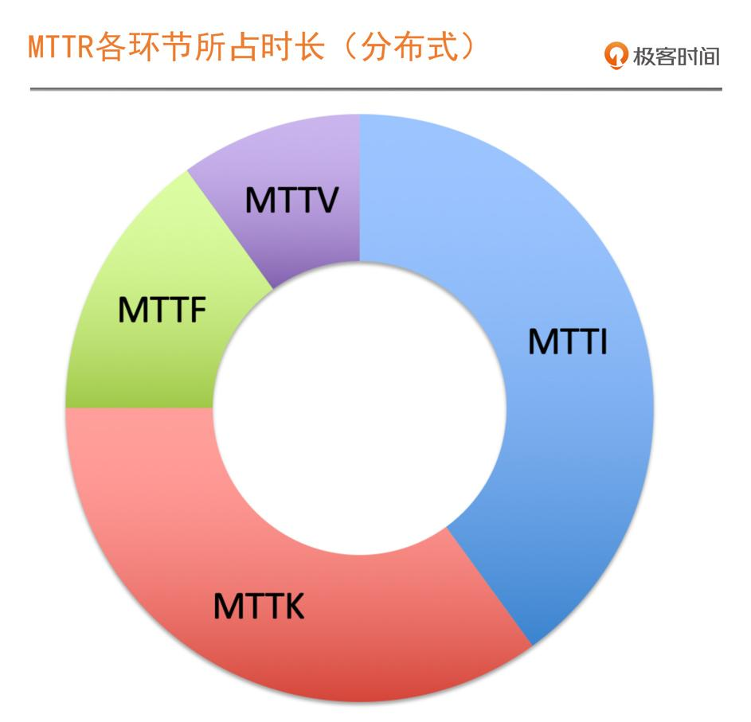

# 故障发现

了解了 SRE 的基础，知道了 SLI、SLO 和 Error Budget，也学会了将 SLO 转化为 错误预算后，我们要做的稳定性提升和保障工作，其实就是减少对错误预算的消耗。

因此，接下来要讨论的问题是：**当我们定义一个问题为故障时，我们应该采取什么措施。**

## 聚焦 MTTR，故障处理的关键环节

**当一个分布式系统发生故障时，我们的策略一定不是找到根因，而是优先恢复业务**

## MTTI：从发现故障到响应故障

两件事：一，判断出现的问题是不是故障；二，确定由谁来响应和召集。

1. 根据错误预算制定故障等级的方式来判定是什么等级的故障从而去响应，这依赖于我们的监控和告警体系

1. 建立 On-Call 机制，确保关键角色必须在线，随时应急响应

## 总结

建立 On-Call 机制的五个关键点：

1. 确保关键角色在线
1. 组织 War Room 应急组织
1. 建立合理的呼叫方式
1. 确保资源投入的升级机制
1. 与云的联合 On-Call
